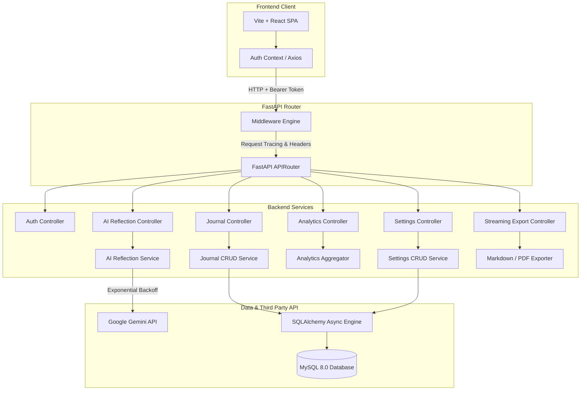
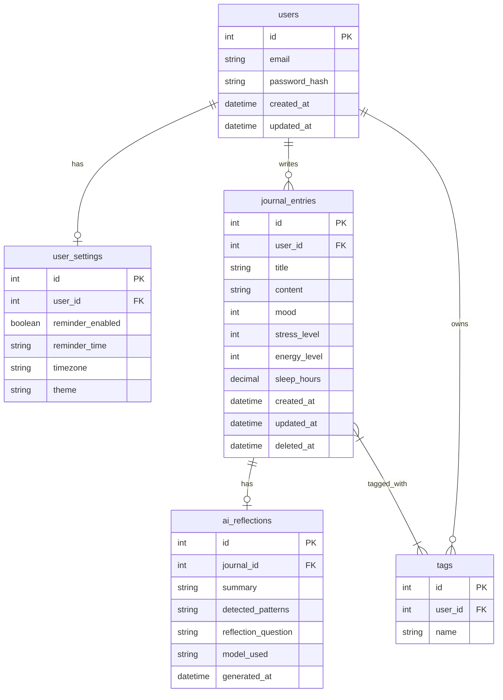

# 🧠 MindSpace — AI-Powered Private Journaling & Reflection Platform

[](https://react.dev/)
[](https://www.typescriptlang.org/)
[](https://fastapi.tiangolo.com/)
[](https://www.python.org/)
[](https://www.mysql.com/)
[](https://www.docker.com/)
[](https://ai.google.dev/)
[](https://tailwindcss.com/)
[](LICENSE)

An elegant, secure, and production-ready journaling platform. MindSpace blends emotional check-ins with non-judgmental AI-assisted reflection prompts using Google Gemini, helping users build healthy writing habits and understand their mental trends over time.

---

## 🔍 Project Overview

MindSpace was built to bridge the gap between simple text-based diaries and clinical mental health tracking. It provides a peaceful, calm, and private sanctuary for modern writing. 

* **The Problem:** Modern journal systems are either basic text forms or clinical questionnaires that feel clinical, encouraging diagnostic self-labeling rather than reflective exploration.
* **Our Solution:** An intuitive canvas that evaluates mood, stress, energy, and sleep metrics. The platform generates thoughtful reflection prompts based on journal entries without making medical claims.
* **Target Audience:** Thinkers, writers, and individuals seeking to track their personal patterns and cultivate mindfulness safely.

---

## 🛠️ Key Features

| Feature | Icon | Description |
| :--- | :---: | :--- |
| **JWT Authentication** | 🔑 | Secure user registration, password hashing (Bcrypt), and authorization guards. |
| **Journal Canvas** | 📝 | Rich text journaling workspace with mood, stress, energy, and sleep trackers. |
| **AI Reflection Engine** | 🤖 | Generates summaries, emotional patterns, positive observations, and prompts. |
| **Crisis Filter Bypasses** | 🛡️ | Automatically filters entries for self-harm keywords, displaying supportive crisis resources. |
| **Exponential Backoff** | 🔄 | Resilience layers featuring retries and offline Python fallbacks during Gemini API outages. |
| **Analytics Dashboard** | 📊 | Visualizes sleep, stress, energy, and mood trends over time using Recharts. |
| **Streaming Exporter** | 💾 | Low-overhead byte streams exporting journals to Markdown (.md) or ReportLab PDF. |
| **Regional Customization** | ⚙️ | Configure custom writing time reminders, themes, and timezone translations. |
| **Diagnostics & Monitoring** | 🩺 | Startup environments validation, `/health` diagnostics, and `/ready` endpoints. |
| **Observability Tracing** | 📑 | UUID-based request tracing, slow request warning indicators, and logging. |
| **Visual Themes** | 🎨 | Clean user interfaces supporting Slate Dark, Alabaster Light, and Aurora Glass themes. |
| **Docker Infrastructure** | 🐳 | Docker Compose orchestration linking MySQL 8.0 health checks and FastAPI endpoints. |

---

## 📸 Screenshots

### 📊 Dashboard

*A premium hero dashboard highlighting streak statistics, mood averages, writing metrics, and recent reflections.*

### 📝 Journal Editor

*A simple, distraction-free text editor integrating slider inputs for biometric metrics and active tag chips.*

### 🤖 AI Reflection

*Non-judgmental, warm AI reflections displaying summary insights and thoughtful reflection questions.*

### 📈 Analytics

*Historical trends showing mood charts, biometric correlations, and tag clouds.*

### 📅 Timeline

*A chronologically organized feed with filters for keywords, metrics, and tags.*

### ⚙️ Settings

*Preferences configurations for daily reminders, timezones, themes, and file exports.*

---

## 🚀 Tech Stack

| Layer | Technology | Purpose |
| :--- | :--- | :--- |
| **Frontend** | React, TypeScript, Vite | Fast Single-Page Application compiling client bundles. |
| **Styling** | Tailwind CSS, Lucide Icons | Clean CSS variables supporting theme switches and icons. |
| **Charts** | Recharts | Dynamic SVG graphs visualizing user health metrics. |
| **Backend** | FastAPI (Python) | High-performance asynchronous API endpoints. |
| **Database ORM** | SQLAlchemy (Async) | Non-blocking database session querying. |
| **Migrations** | Alembic | Evolution of schemas across SQLite (testing) and MySQL (production). |
| **Database** | MySQL 8.0 | Relational database containing indexed foreign key tables. |
| **AI Integration** | Google Generative AI | Interfaces FastAPI with Google Gemini 2.5 Flash models. |
| **Testing** | Pytest, Asyncio, HTTPAnyio | Asynchronous endpoint validations and mock assertions. |

---

## 🏗️ System Architecture



---

## 🗄️ Database Design



---

## 📂 Folder Structure

```
mindspace/
├── docker-compose.yml         # Containerized database & backend config
├── README.md                  # System documentation
├── walkthrough.md             # Sprint 6 release notes
├── frontend/                  # React Single-Page Application (Vite)
│   ├── package.json
│   ├── src/
│   │   ├── components/        # Protected routes & skeleton load widgets
│   │   ├── contexts/          # JWT authentication context
│   │   ├── pages/             # Dashboard, Timeline, Analytics, Settings
│   │   └── App.tsx            # Routes configurations
│   └── index.html
└── backend/                   # FastAPI Server Application
    ├── requirements.txt
    ├── main.py                # Server mount & exception handlers
    ├── app/
    │   ├── config.py          # Environment settings validations
    │   ├── database.py        # SQLAlchemy connections
    │   ├── models/            # SQLAlchemy database schemas
    │   ├── schemas/           # Pydantic input models
    │   ├── routes/            # API routing handlers
    │   ├── services/          # Business logic layers (Auth, PDF, AI)
    │   └── tests/             # Pytest suite
    └── alembic/               # Database migration versions
```

---

## 🚀 Local Development

### Prerequisites
* Docker & Docker Compose
* Python 3.10+
* Node.js 18+

### Quick Start (Dockerized Production Run)
The simplest way to spin up the platform is using Docker Compose:
```bash
# Clone the repository
git clone https://github.com/yourusername/mindspace.git
cd mindspace

# Build and start services (MySQL + FastAPI Backend)
docker compose up -d --build

# Run database migrations
docker compose exec backend alembic upgrade head
```
* Frontend client: `http://localhost:5173`
* Swagger docs: `http://localhost:8000/docs`

---

### Host-Based Development

#### 1. Setup Database & Backend
```bash
cd backend
python3 -m venv .venv
source .venv/bin/activate
pip install -r requirements.txt

# Configure environmental variables
cp .env.example .env

# Run migrations
alembic upgrade head

# Start development server
uvicorn main:app --reload
```

#### 2. Setup Frontend Client
```bash
cd frontend
npm install
npm run dev
```

---

## 📋 API Overview

<details>
<summary>🔑 Authentication</summary>

* `POST /api/v1/auth/register` - Create user profile. Requires valid format email & password checks.
* `POST /api/v1/auth/login` - Authenticate credentials and retrieve bearer JWT token.
* `GET /api/v1/profile` - Fetch profile details of the active user session.
</details>

<details>
<summary>📝 Journal Entries</summary>

* `POST /api/v1/journals` - Log a new entry with mood, stress, energy, sleep hours, and tag lists.
* `GET /api/v1/journals` - Filter and retrieve journal logs list.
* `GET /api/v1/journals/{id}` - Fetch details of an entry. Validates ownership rules.
* `PUT /api/v1/journals/{id}` - Update text, metrics ratings, or tags.
* `DELETE /api/v1/journals/{id}` - Soft delete journal logs (appends deletion timestamp).
</details>

<details>
<summary>🤖 Reflections & Analytics</summary>

* `POST /api/v1/journals/{id}/generate-reflection` - Triggers Gemini model to compile reflection prompts.
* `GET /api/v1/journals/{id}/reflection` - Retrieves cached reflection.
* `GET /api/v1/analytics/dashboard` - Consolidates metrics distributions, trends, streaks, and summaries.
</details>

<details>
<summary>💾 Export & Settings</summary>

* `GET /api/v1/settings` - Retrieve theme, reminders, and timezone configurations (seeds defaults on miss).
* `PUT /api/v1/settings` - Modify preferences parameters (reminders validate HH:MM regex).
* `GET /api/v1/export/journals/{id}` - Streams individual entry download (Markdown or PDF).
* `GET /api/v1/export/journals/all` - Streams entire journal history package (Markdown or PDF).
</details>

<details>
<summary>🩺 Diagnostics</summary>

* `GET /health` - Checks application database connection ping, Gemini variables configuration, and uptime.
* `GET /ready` - Returns status state (200 / 503) for deployment monitoring.
</details>

---

## 🧪 Testing & Quality Assurance

### 1. Backend Testing
We run **36 asynchronous backend tests** (verifying duplicate registration rules, secure HTTP headers, diagnostics checkpoints, and IP rate limits) inside an in-memory SQLite database environment:
```bash
cd backend
.venv/bin/pytest
```

### 2. Frontend Checks
Validate static types and build production minified structures:
```bash
cd frontend
npm run lint    # TypeScript type check compile
npm run build   # Production Vite bundle compile
```

---

## 🛡️ Production & Performance Configurations

### Security Measures
* **In-Memory Rate Limiting:** Auth endpoints (`/register`, `/login`) are rate-limited to 5 requests per 60 seconds based on client IP addresses to block dictionary attacks.
* **Secure Middleware Headers:** Middleware auto-injects standard headers (`X-Frame-Options: DENY`, `X-Content-Type-Options: nosniff`, `Content-Security-Policy`) onto all responses.
* **JWT Validity:** Access tokens are signed using cryptographic keys (`HS256`) and validate expiration windows.

### Performance Tunings
* **Database Indexes:** Added index on `created_at` and a compound table index `(user_id, deleted_at)` to guarantee sub-millisecond query results on timeline filtering.
* **Eager Relationship Loading:** Queries eager-load related tables (`tags`, `reflection`) using SQLAlchemy's `selectinload` helper to prevent database N+1 loop latencies.
* **Memory-Efficient File Exporters:** Exports utilize `io.BytesIO` byte stream buffers inside FastAPI's `StreamingResponse`, bypassing disk I/O operations.

---

## 📈 Release Roadmap

* [x] **Sprint 1:** Core Authentication & User Tables
* [x] **Sprint 2:** Journal CRUD & Tags Junction Maps
* [x] **Sprint 3:** Google Gemini Reflection Engine & Safety Pre-Scan Bypass
* [x] **Sprint 4:** Dynamic Analytics Charts Dashboard
* [x] **Sprint 5:** Preferences Configurations & ReportLab PDF Exporters
* [x] **Sprint 6:** Performance, Secure Headers, Rate Limiting, & Uptime Diagnostics
* [x] **Sprint 7:** Portfolio Documentation, Diagrams, & Repository Polish

---

## 🔮 Future Enhancements

* **Redis Integration:** Move sliding-window rate limit caches to Redis key lists to support horizontal load balancers.
* **Push Notifications:** Configure timezone reminders using desktop notifications.
* **OAuth Login Support:** Provide Google and GitHub login options.
* **Mobile Client:** Native Android & iOS wrappers.

---

## 🤝 Contributing

Contributions are welcome! Please follow these guidelines:
1. Fork the project.
2. Create a feature branch: `git checkout -b feature/AmazingFeature`.
3. Commit your changes: `git commit -m 'Add some AmazingFeature'`.
4. Push to the branch: `git push origin feature/AmazingFeature`.
5. Open a Pull Request.

---

## 📄 License

Distributed under the MIT License. See `LICENSE` for more information.
