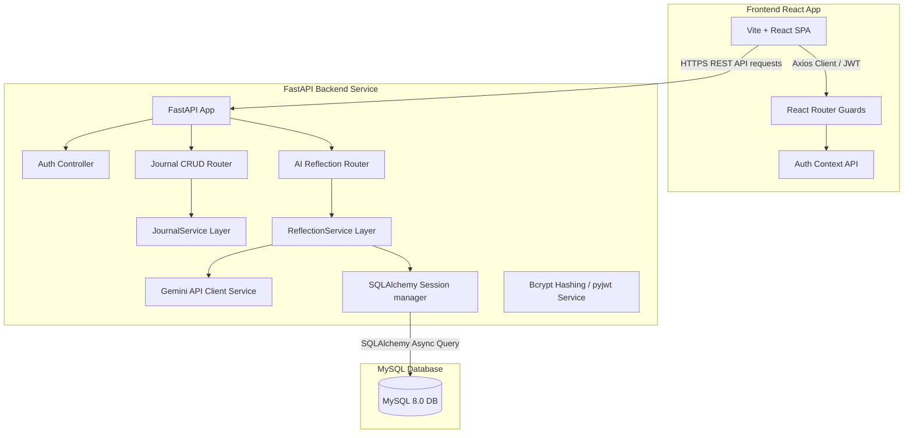

# 🧠 MindSpace

An AI-powered private reflection and journaling platform that helps users build healthy reflection habits, understand emotional patterns, and receive AI-assisted insights while maintaining complete privacy.
---

## 🏗️ System Architecture



---

## 🚀 Tech Stack

* **Frontend:** React 18, Vite, Tailwind CSS, React Router, Lucide Icons, Axios.
* **Backend:** FastAPI, SQLAlchemy ORM, Alembic Migrations, PyJWT (token auth), Bcrypt (password security).
* **Database:** MySQL 8.0 (Relational persistent storage).
* **Virtualization:** Docker, Docker Compose.
* **Testing:** Pytest (including `pytest-asyncio` and `aiosqlite` for isolated async test runs).

---

## 📂 Repository Structure

```
mindspace/
├── docker-compose.yml
├── README.md
├── software_design_document.md
├── walkthrough.md
├── frontend/                  # React Single-Page Application
│   ├── package.json
│   ├── vite.config.ts
│   ├── tailwind.config.js
│   └── src/
│       ├── components/        # Protected routes & skeleton loaders
│       ├── contexts/          # Auth JWT Context API
│       ├── pages/             # Dashboard, Editor, and Timeline Pages
│       └── main.tsx
└── backend/                   # FastAPI Web Application
    ├── Dockerfile
    ├── requirements.txt
    ├── main.py                # Server mount
    ├── app/
    │   ├── config.py          # Settings validation
    │   ├── database.py        # SQLAlchemy connections
    │   ├── models/            # SQLAlchemy DB entities (User, JournalEntry, Tag, AIReflection)
    │   ├── schemas/           # Pydantic validation rules (User, Journal, Reflection)
    │   ├── routes/            # Auth, journal, and reflection controllers
    │   ├── services/          # Hashing, JWT signature, journal CRUD, and AI reflection services
    │   └── tests/             # Async Pytest suite (Auth, Journal, and AI tests)
    └── alembic/               # Schema evolution versioning
```

---

## 🗄️ Database Schema & Relational Design

MindSpace utilizes a normalized relational schema. Indexes are established on foreign keys and search coordinates to guarantee sub-millisecond retrieval.

### Table: `users`
* `id` (INT, Primary Key, Auto-Increment)
* `email` (VARCHAR(255), Unique, Indexed, Not Null)
* `password_hash` (VARCHAR(255), Not Null)
* `created_at` (TIMESTAMP, Default: CURRENT_TIMESTAMP)
* `updated_at` (TIMESTAMP, Default: CURRENT_TIMESTAMP)

### Table: `journal_entries`
* `id` (INT, Primary Key, Auto-Increment)
* `user_id` (INT, Foreign Key referencing `users(id)` ON DELETE CASCADE, Indexed, Not Null)
* `title` (VARCHAR(255), Not Null)
* `content` (TEXT, Not Null)
* `mood` (TINYINT, Range 1-5, Not Null)
* `stress_level` (TINYINT, Range 1-5, Not Null)
* `energy_level` (TINYINT, Range 1-5, Not Null)
* `sleep_hours` (DECIMAL(4,2), Not Null)
* `created_at` (TIMESTAMP, Default: CURRENT_TIMESTAMP)
* `updated_at` (TIMESTAMP, Default: CURRENT_TIMESTAMP)
* `deleted_at` (TIMESTAMP, Nullable) -- *Used for user soft-deletes*

### Table: `tags`
* `id` (INT, Primary Key, Auto-Increment)
* `user_id` (INT, Foreign Key referencing `users(id)` ON DELETE CASCADE, Indexed, Not Null) -- *Ensures tags remain private and user-scoped*
* `name` (VARCHAR(100), Indexed, Not Null)

### Table: `journal_tags` (Junction Table)
* `entry_id` (INT, Foreign Key referencing `journal_entries(id)` ON DELETE CASCADE, Primary Key)
* `tag_id` (INT, Foreign Key referencing `tags(id)` ON DELETE CASCADE, Primary Key)

### Table: `ai_reflections`
* `id` (INT, Primary Key, Auto-Increment)
* `journal_id` (INT, Foreign Key referencing `journal_entries(id)` ON DELETE CASCADE, Unique, Indexed, Not Null) -- *One-to-one mapping*
* `summary` (TEXT, Not Null)
* `detected_patterns` (TEXT, Not Null) -- *Serialized JSON list of strings*
* `reflection_question` (TEXT, Not Null)
* `generated_at` (TIMESTAMP, Default: CURRENT_TIMESTAMP)
* `model_used` (VARCHAR(50), Not Null) -- *e.g., 'gemini-1.5-flash' or 'safety_filter'*

## 🛡️ Production Readiness, Security & Diagnostics

MindSpace implements enterprise-grade production readiness features:

### 1. Database Query Optimizations (N+1 Resolution)
* **Eager Loading:** Timeline lists and single journal lookups utilize SQLAlchemy's `selectinload` to eager-load associated tags and AI reflections, resolving N+1 latency issues.
* **Schema Indexes:** Added indexes on `created_at` (for timeline range pagination) and a compound index `ix_journal_entries_user_deleted` on `(user_id, deleted_at)` to optimize lookup performance.

### 2. API Security Mappings
* **In-Memory Rate Limiting:** Auth endpoints (`/register` and `/login`) are shielded by IP-based sliding-window rate limiters to prevent brute-force attacks.
* **CORS Whitelisting:** Permissive wildcard (`*`) settings have been replaced with configurable allowed CORS domains loaded from settings (defaulting to safe local hosts in development).
* **Secure HTTP Response Headers:** Custom middleware automatically injects headers on all API responses:
  * `X-Frame-Options: DENY` (prevents Clickjacking)
  * `X-Content-Type-Options: nosniff` (mitigates MIME sniffing)
  * `X-XSS-Protection: 1; mode=block` (prevents cross-site scripting)
  * `Content-Security-Policy: default-src 'self';` (mitigates XSS injections)
  * `Referrer-Policy: strict-origin-when-cross-origin`

### 3. Observability & Request Tracing
* **X-Request-ID Header:** All incoming API calls are assigned a unique UUID `X-Request-ID` attached to thread execution contexts and log outputs.
* **Endpoint timing & warnings:** Logs compile exact request duration times in milliseconds and emit warnings if execution durations exceed 800ms.

### 4. Health & Readiness Diagnostics
* **GET `/health`**: Asserts MySQL database connectivity, checks Gemini API configurations, version parameters, and computes system uptime.
* **GET `/ready`**: Returns a check status used by orchestrators to confirm if the app instance is ready to receive network traffic.

---

## ⚙️ Environment Variables

The backend uses a `.env` file to manage configurations. Pydantic validates these variables at server startup, causing the system to fail fast if critical values are missing:

| Variable | Type | Default | Description |
|---|---|---|---|
| `DATABASE_URL` | String | *Required* | Connection string. Format: `mysql+aiomysql://<user>:<pass>@<host>:<port>/<db>` |
| `JWT_SECRET_KEY` | String | *Required* | Cryptographic salt used to sign JWT signatures. |
| `JWT_ALGORITHM` | String | `HS256` | Encrypt signature hashing algorithm used. |
| `ACCESS_TOKEN_EXPIRE_MINUTES` | Integer | `1440` | Token validity timeframe in minutes (24 hours). |
| `GEMINI_API_KEY` | String | `mock-key-for-local-testing` | API Key used to call Google Gemini. Fallbacks mock-key locally for tests. |
| `ALLOWED_CORS_ORIGINS` | String | *See config.py* | Comma-separated list of whitelisted CORS domains. |

---

## 📋 API Endpoints Reference

| Protocol | Endpoint | Authorization | Status Codes | Description |
|---|---|---|---|---|
| **POST** | `/api/v1/auth/register` | None | 201, 400, 422, 429 | Register user account. Requires valid email & strong password. Protected by rate limiting. |
| **POST** | `/api/v1/auth/login` | None | 200, 401, 422, 429 | Authenticate and retrieve bearer access tokens. Protected by rate limiting. |
| **GET** | `/api/v1/profile` | Bearer Token | 200, 401 | Retrieve profile details of the active user. |
| **POST** | `/api/v1/journals` | Bearer Token | 201, 400, 401, 422 | Create new journal entry with metric ratings and tag list. |
| **GET** | `/api/v1/journals` | Bearer Token | 200, 401 | List user journals. Supports filters: `mood`, `tag`, `start_date`, `end_date`, `search`. |
| **GET** | `/api/v1/journals/{id}` | Bearer Token | 200, 401, 403, 404 | Fetch individual entry. Validates user ownership. |
| **PUT** | `/api/v1/journals/{id}` | Bearer Token | 200, 401, 403, 404, 422 | Modify entry text fields, metrics, or rebuild tag mappings. |
| **DELETE** | `/api/v1/journals/{id}` | Bearer Token | 200, 401, 403, 404 | Soft delete entry (sets `deleted_at` timestamp). |
| **POST** | `/api/v1/journals/{id}/generate-reflection` | Bearer Token | 200, 401, 403, 404, 502 | Trigger Google Gemini reflection insights generation (or update cache). |
| **GET** | `/api/v1/journals/{id}/reflection` | Bearer Token | 200, 401, 403, 404 | Retrieve cached AI reflection, returns 404 if stale or missing. |
| **GET** | `/health` | None | 200, 500 | Diagnoses database health, Gemini setups, uptime, and versions. |
| **GET** | `/ready` | None | 200, 503 | Readiness check used for deployment orchestrators. |

---

## 🛠️ Database Migrations (Alembic)

Alembic runs migrations synchronously. The env script `backend/alembic/env.py` automatically converts async driver protocols `mysql+aiomysql://` and `sqlite+aiosqlite://` to standard sync ones `mysql+pymysql://` and `sqlite://` to avoid event-loop conflicts.

* **Generate a new migration script (autodetect schema changes):**
  ```bash
  DATABASE_URL=sqlite+aiosqlite:///local.db .venv/bin/alembic revision --autogenerate -m "description_of_change"
  ```
* **Apply migrations to database (Upgrade to HEAD):**
  * *Local environment:*
    ```bash
    .venv/bin/alembic upgrade head
    ```
  * *Docker environment:*
    ```bash
    docker-compose exec backend alembic upgrade head
    ```
* **Rollback a migration (Downgrade by 1 step):**
  ```bash
  .venv/bin/alembic downgrade -1
  ```

---

## ⚙️ Setup & Running Guide

### Containerized Execution (Docker Compose)
1. Ensure the Docker Daemon is active on your host.
2. Run the following command in the project root:
   ```bash
   docker-compose up --build
   ```
3. The frontend is accessible at `http://localhost:5173`, and the FastAPI Swagger UI is at `http://localhost:8000/docs`.

### Local Development (Host-Based Execution)

#### Backend Configuration
1. Navigate to `/backend`.
2. Initialize and activate a Python virtual environment:
   ```bash
   python3 -m venv .venv
   source .venv/bin/activate
   ```
3. Install package dependencies:
   ```bash
   pip install -r requirements.txt
   ```
4. Copy env template and set local database environment variables:
   ```bash
   cp .env.example .env
   ```
5. Launch the FastAPI development server:
   ```bash
   uvicorn main:app --reload
   ```

#### Frontend Configuration
1. Navigate to `/frontend`.
2. Install npm modules:
   ```bash
   npm install
   ```
3. Boot the local Vite development server:
   ```bash
   npm run dev
   ```

---

## 🧪 Testing and Verification

### Backend Pytest Suite
We test all API handlers (registration checks, duplicates, password hashes, and headers) inside an isolated, async, in-memory SQLite database.
To execute tests locally from the `/backend` directory:
```bash
.venv/bin/pytest
```

### Frontend Build & Lint checks
To verify the client builds cleanly without compilation warnings:
```bash
npm run build
```
And to perform type checks:
```bash
npm run lint
```
