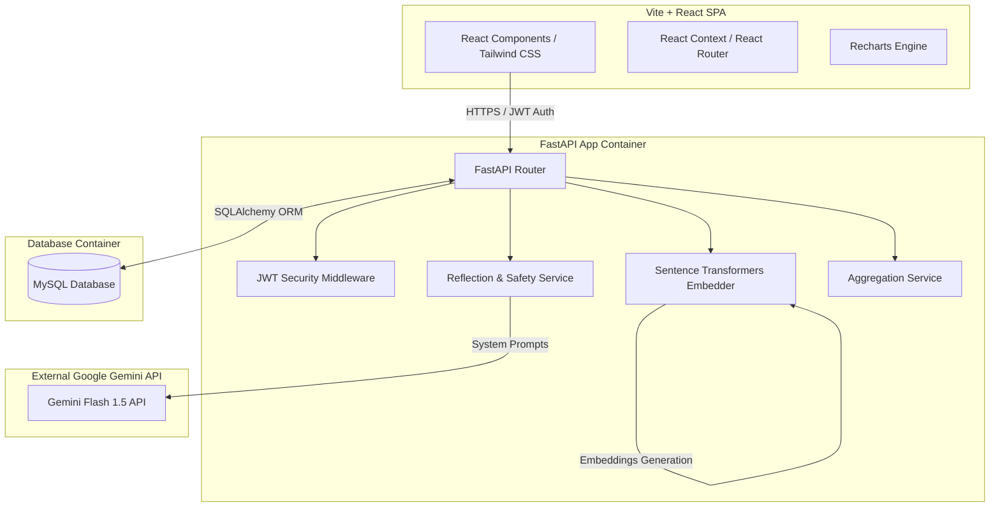
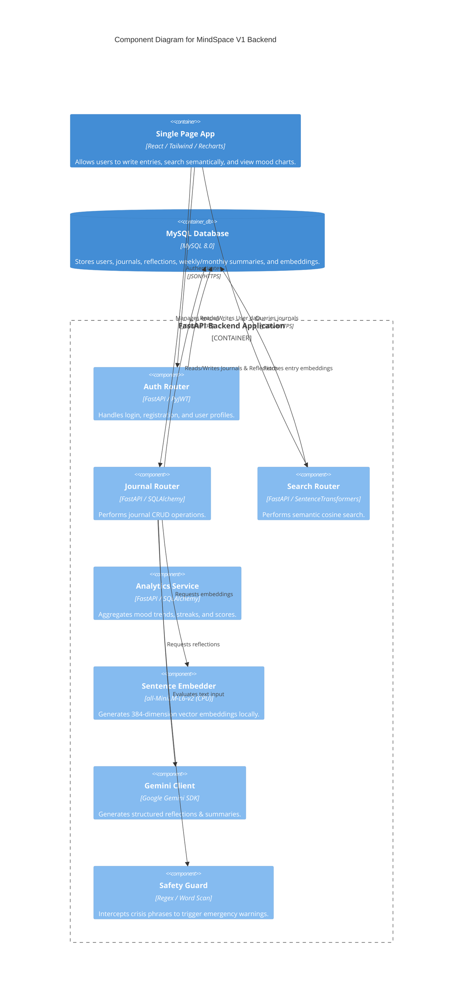
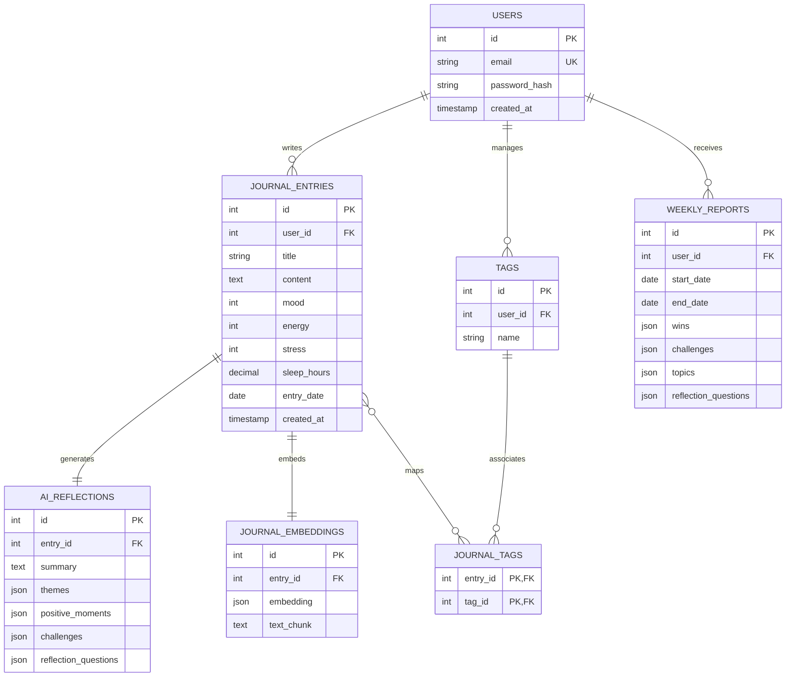
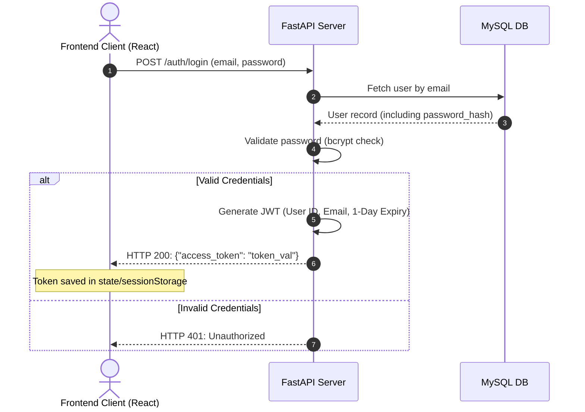
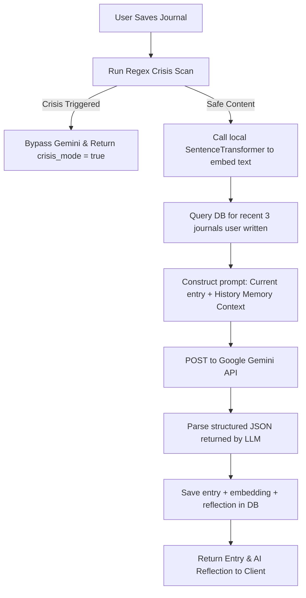
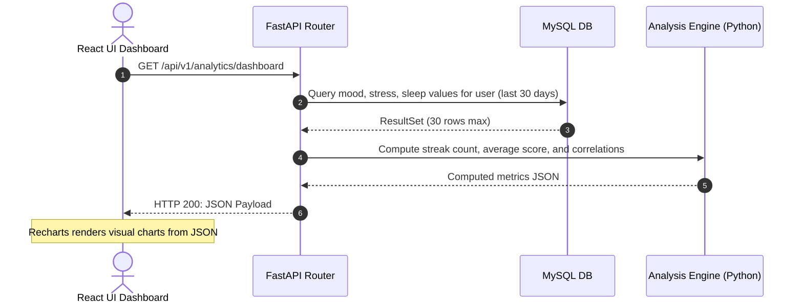

# Software Design Document (SDD)
## Project: MindSpace (AI-Powered Reflection & Journaling Platform)
**Version:** 1.0.0 (V1 Release Candidate)  
**Target:** Production-Quality MVP & Interview Flagship  
**Author:** Full-Stack AI Engineer & Software Architect  

---

## 1. Product Requirements Document (PRD)

### 1.1 Product Vision & Core Mission
MindSpace is a secure, private, AI-powered reflection companion. It helps students and young professionals process stress, capture daily experiences, explore cognitive patterns, and develop long-term self-awareness through structured interactive journaling.

> [!IMPORTANT]
> **Safety and Ethics Boundary:** MindSpace is **not** a therapist, psychologist, or medical diagnostics system. It does not provide medical advice or manage clinical crises. The AI focuses purely on structured self-reflection, patterns, and open-ended journaling questions.

### 1.2 Target Audience & Real-World Problem
Young professionals and students face substantial pressure but lack comfortable, private outlets to express thoughts. Regular text journals store data passively, making it tedious to notice behaviors or cognitive distortions over time. MindSpace solves this by using safe, non-diagnostic AI reflection and semantic search, making self-journaling active and insightful.

### 1.3 Core Pillars of Version 1
* **Reflection-Driven Interface:** Clean, focused text inputs mapped to instant, structured reflections.
* **Privacy & User Ownership:** A secure-by-default local approach allowing complete data deletion and quick JSON/PDF exports.
* **Semantic Retrieval:** Natural language search to let users instantly recall journal entry contexts ("When did I write about job stress?").
* **Safe Guardrails:** Hardcoded crisis detection mechanisms to immediately prioritize human assistance.

---

## 2. Functional Requirements

### 2.1 User Authentication & Profile
* **FR-1.1:** Secure registration, login, and profile modification.
* **FR-1.2:** Session authentication using JSON Web Tokens (JWT).

### 2.2 Journal Entry Management
* **FR-2.1:** Rich markdown journal creation, reading, updating, and deletion (CRUD).
* **FR-2.2:** Metadata tracking: Daily Mood (1-5), Energy (1-5), Stress (1-5), Sleep Hours, user-defined Tags, and Entry Date.
* **FR-2.3:** Historical journal browsing and text searching.

### 2.3 AI Reflection Engine
* **FR-3.1:** Auto-generation of Reflection Summary, Key Themes, Positive Moments, Challenges, and Reflection Questions upon saving an entry.
* **FR-3.2:** **AI Memory:** Comparison across historical entries to identify long-term patterns ("You've mentioned exams three times this month").

### 2.4 Semantic Search & Retrieval
* **FR-4.1:** Semantic, natural-language query search over historical journal entries.

### 2.5 Analytics & Dynamic Reports
* **FR-5.1:** Visualization of mood/energy/stress trends and sleep correlations.
* **FR-5.2:** Periodic Aggregations: Weekly Reflection summaries and Monthly Growth Insights.
* **FR-5.3:** Year In Review: A Spotify Wrapped style annual summary mapping milestones and growth highlights.
* **FR-5.4:** **Reflection Score:** A non-mental health index rating writing consistency, word depth, self-awareness cues, and gratitude.

### 2.6 AI Safety Guardrail
* **FR-6.1:** Real-time crisis detection scanning to trigger local helpline banners instead of generating AI reflection.

---

## 3. Non-functional Requirements

* **Performance:** Text save operations must complete under 150ms. Semantic search query latency must be under 300ms.
* **Availability:** Database design and modular application code suited for standard single-node cloud virtual machine deployment.
* **Maintainability & Clean Code:** Code structured to allow modular expansion (e.g., switching database engines or adding AI endpoints) without refactoring the core controllers.
* **Interview Readability:** Clear component separations and straightforward algorithms to explain during interviews without checking source files.

---

## 4. User Personas

### 4.1 Persona A: Chloe (The Overworked Student)
* **Age:** 22, Final Year CS Undergrad.
* **Pain Point:** Struggles to balance internship search, classwork, and personal relationships. Feels overloaded and finds traditional journals stagnant.
* **How MindSpace Helps:** The AI reflection summarizes her stressors and asks guidance questions to help her decompress, while semantic search lets her quickly check how she managed stress during prior exam seasons.

### 4.2 Persona B: Marcus (The Tech Consultant)
* **Age:** 27, Junior Consultant.
* **Pain Point:** Frequently travels, experiences erratic sleep, and notices mood fluctuations but cannot correlate them to specific habits or weekly stressors.
* **How MindSpace Helps:** The dashboard visualizes his Sleep vs. Mood trends, and weekly summaries capture his recurring professional triumphs and blocks.

---

## 5. User Stories

1. *As a user,* I want to log my sleep hours, mood, energy, and stress alongside my journal entry so that I can track my overall life patterns.
2. *As a user,* I want the system to generate immediate reflective feedback on my entry so that I can look at my thoughts from an objective perspective.
3. *As a user,* I want to run a natural language search like "When did I feel confident about my career?" to find exact moments without remembering dates.
4. *As a user,* I want to see my weekly writing streak and reflection score so that I can build a consistent reflection habit.
5. *As a user,* I want to be redirected immediately to crisis support lines if I write about self-harm, ensuring I receive professional care.

---

## 6. Complete System Architecture

To ensure Version 1 remains realistic to build and easy to explain in interviews, the architecture is a **simplified monolith-first design** running inside Docker containers.



---

## 7. High-Level Component Diagram



---

## 8. Folder Structure

We organize the codebase into a clean monorepo layout using `/frontend` and `/backend` directories, ensuring clear separation of concerns.

```
mindspace/
├── docker-compose.yml
├── README.md
├── frontend/                  # React + Vite SPA
│   ├── package.json
│   ├── vite.config.ts
│   ├── tailwind.config.js
│   ├── index.html
│   └── src/
│       ├── assets/            # Global styling, logos
│       ├── components/        # Shared components (Buttons, Inputs, Navbar)
│       ├── hooks/             # Custom custom hooks (useAuth, useFetch)
│       ├── layouts/           # Page structures (AppLayout, AuthLayout)
│       ├── pages/             # Route views (Dashboard, JournalEditor, Timeline, Analytics)
│       ├── services/          # API layer (axios clients)
│       └── utils/             # Math logic, date formatting, helpers
└── backend/                   # FastAPI Backend
    ├── Dockerfile
    ├── requirements.txt
    ├── alembic.ini            # DB migration configuration
    ├── main.py                # Fast API entry point
    └── app/
        ├── config.py          # Environment settings
        ├── database.py        # SQLAlchemy engine and session mapping
        ├── models/            # SQLAlchemy Database Entities
        ├── schemas/           # Pydantic Schemas for validation
        ├── routes/            # Route controllers (auth, journals, etc.)
        ├── services/          # Business logic:
        │   ├── ai.py          # Gemini API interactions
        │   ├── search.py      # Cosine similarity logic for embeddings
        │   ├── safety.py      # Regex crisis detection
        │   └── score.py       # Reflection Score mathematical engine
        └── tests/             # Pytest test suite
```

---

## 9. Database Schema (Normalized MySQL)

### 9.1 Overview of Database Design
To guarantee interview simplicity, we map our requirements to a normalized MySQL 8.0 schema.
* **Semantic Embeddings:** Stored in a separate table `journal_embeddings` referencing `journal_entries.id`. We store the vector as a `JSON` or `LONGBLOB` representing the array of float values (`float32[]`).
* **Streaks & Reports:** Generated dynamically or cached inside `weekly_reports` and `monthly_reports`.
* **Database Indexes:** Configured on fields like `user_id`, `entry_date`, and email logins to optimize query performance.

### 9.2 Tables Definition

#### Table: `users`
| Column Name | Type | Key / Constraint | Description |
|---|---|---|---|
| `id` | INT | PRIMARY KEY, AUTO_INCREMENT | Unique identifier |
| `email` | VARCHAR(255) | UNIQUE, NOT NULL, INDEX | Login credential |
| `password_hash` | VARCHAR(255) | NOT NULL | Hashed value (bcrypt / Argon2) |
| `created_at` | TIMESTAMP | DEFAULT CURRENT_TIMESTAMP | Row creation time |
| `updated_at` | TIMESTAMP | DEFAULT CURRENT_TIMESTAMP ON UPDATE | Row update time |

#### Table: `journal_entries`
| Column Name | Type | Key / Constraint | Description |
|---|---|---|---|
| `id` | INT | PRIMARY KEY, AUTO_INCREMENT | Entry identifier |
| `user_id` | INT | FOREIGN KEY (`users.id`), INDEX | Owning user ID |
| `title` | VARCHAR(255) | NOT NULL | Title of the journal |
| `content` | TEXT | NOT NULL | Journal content text |
| `mood` | TINYINT | CHECK (`mood` BETWEEN 1 AND 5) | Mood rating |
| `energy` | TINYINT | CHECK (`energy` BETWEEN 1 AND 5) | Energy rating |
| `stress` | TINYINT | CHECK (`stress` BETWEEN 1 AND 5) | Stress rating |
| `sleep_hours` | DECIMAL(4,2) | CHECK (`sleep_hours` >= 0) | Sleep tracking value |
| `entry_date` | DATE | NOT NULL, INDEX | Date of entry (allows past logging) |
| `created_at` | TIMESTAMP | DEFAULT CURRENT_TIMESTAMP | System timestamp |

#### Table: `journal_embeddings`
| Column Name | Type | Key / Constraint | Description |
|---|---|---|---|
| `id` | INT | PRIMARY KEY, AUTO_INCREMENT | Embedding identifier |
| `entry_id` | INT | FOREIGN KEY (`journal_entries.id`) ON DELETE CASCADE, INDEX | Associated journal entry |
| `embedding` | JSON | NOT NULL | JSON Array of 384 dimensions (floats) |
| `text_chunk` | TEXT | NOT NULL | The text block represented |

#### Table: `ai_reflections`
| Column Name | Type | Key / Constraint | Description |
|---|---|---|---|
| `id` | INT | PRIMARY KEY, AUTO_INCREMENT | Reflection identifier |
| `entry_id` | INT | FOREIGN KEY (`journal_entries.id`) ON DELETE CASCADE, UNIQUE | Associated journal |
| `summary` | TEXT | NOT NULL | Text summary of the entry |
| `themes` | JSON | NOT NULL | Array of themes (e.g., ["school", "stress"]) |
| `positive_moments`| JSON | NOT NULL | Array of positive takeaways |
| `challenges` | JSON | NOT NULL | Array of problems identified |
| `reflection_questions` | JSON | NOT NULL | Array of prompted questions for user |

#### Table: `tags`
| Column Name | Type | Key / Constraint | Description |
|---|---|---|---|
| `id` | INT | PRIMARY KEY, AUTO_INCREMENT | Tag identifier |
| `user_id` | INT | FOREIGN KEY (`users.id`), INDEX | User who created the tag |
| `name` | VARCHAR(50) | NOT NULL | Tag name text |

#### Table: `journal_tags`
| Column Name | Type | Key / Constraint | Description |
|---|---|---|---|
| `entry_id` | INT | FOREIGN KEY (`journal_entries.id`) ON DELETE CASCADE | Associated entry |
| `tag_id` | INT | FOREIGN KEY (`tags.id`) ON DELETE CASCADE | Associated tag |
| **Composite Key** | (`entry_id`, `tag_id`) | PRIMARY KEY | Unique mapping constraint |

#### Table: `weekly_reports`
| Column Name | Type | Key / Constraint | Description |
|---|---|---|---|
| `id` | INT | PRIMARY KEY, AUTO_INCREMENT | Report identifier |
| `user_id` | INT | FOREIGN KEY (`users.id`), INDEX | Target user |
| `start_date` | DATE | NOT NULL | Start date of week |
| `end_date` | DATE | NOT NULL | End date of week |
| `wins` | JSON | NOT NULL | Array of weekly positive highlights |
| `challenges` | JSON | NOT NULL | Array of weekly blocks |
| `topics` | JSON | NOT NULL | Topics discussed during the week |
| `reflection_questions` | JSON | NOT NULL | Overall coaching queries |

---

## 10. ER Diagram



---

## 11. API Design

All endpoints return JSON responses. Protected endpoints require authorization header: `Authorization: Bearer <JWT_ACCESS_TOKEN>`.

### 11.1 Authentication & Profile
* **`POST /api/v1/auth/register`**  
  Creates a new user.  
  *Request:* `{"email": "user@mail.com", "password": "safePassword1"}`  
  *Response:* `{"id": 1, "email": "user@mail.com", "message": "User registered"}`
* **`POST /api/v1/auth/login`**  
  Verifies credentials and returns access token.  
  *Request:* `{"email": "user@mail.com", "password": "safePassword1"}`  
  *Response:* `{"access_token": "token_str", "token_type": "bearer"}`
* **`GET /api/v1/profile`** [Protected]  
  Returns logged-in user profile.  
  *Response:* `{"id": 1, "email": "user@mail.com", "created_at": "2026-07-02"}`

### 11.2 Journal CRUD
* **`GET /api/v1/journals`** [Protected]  
  Fetches user journals with pagination and date filtering.  
  *Query Parameters:* `skip` (int), `limit` (int), `start_date` (date), `end_date` (date)  
  *Response:* `[{"id": 1, "title": "Example", "mood": 4, "entry_date": "2026-07-02", "tags": ["study"]}]`
* **`POST /api/v1/journals`** [Protected]  
  Creates a new journal entry and triggers synchronous downstream AI tasks (reflection generation & local sentence embedding).  
  *Request:*
  ```json
  {
    "title": "Exam Prep",
    "content": "Studying hard. Feeling a bit anxious but keeping up with revisions.",
    "mood": 3,
    "energy": 4,
    "stress": 3,
    "sleep_hours": 7.5,
    "entry_date": "2026-07-02",
    "tags": ["college", "stress"]
  }
  ```
  *Response:* Returns the saved entry data plus the synchronous AI Reflection object.
* **`GET /api/v1/journals/{id}`** [Protected]  
  Fetches details of a specific entry, including its AI Reflection.
* **`PUT /api/v1/journals/{id}`** [Protected]  
  Updates text/metadata and updates embedding & reflection vectors.
* **`DELETE /api/v1/journals/{id}`** [Protected]  
  Hard deletes entry and cascading tables.

### 11.3 Semantic Search
* **`POST /api/v1/search/semantic`** [Protected]  
  Searches entries using natural language.  
  *Request:* `{"query": "When did I write about job stress?", "limit": 5}`  
  *Response:*
  ```json
  [
    {
      "journal": { "id": 12, "title": "Job Interviews", "entry_date": "2026-06-15" },
      "similarity_score": 0.76
    }
  ]
  ```

### 11.4 Analytics & Summaries
* **`GET /api/v1/analytics/dashboard`** [Protected]  
  Returns metadata tracking summaries for charts (mood trends, streaks, averages).
* **`GET /api/v1/reports/weekly`** [Protected]  
  Fetches weekly reports. Query: `?date=2026-07-02`. Returns report or generates it if it doesn't exist.
* **`GET /api/v1/reports/monthly`** [Protected]  
  Fetches monthly analytics.

### 11.5 Privacy Exports
* **`GET /api/v1/privacy/export/json`** [Protected]  
  Exports all journals, reflections, and scores in a structured JSON wrapper.
* **`GET /api/v1/privacy/export/pdf`** [Protected]  
  Returns printable layout PDF of user history.
* **`DELETE /api/v1/privacy/purge-account`** [Protected]  
  Completely deletes user and associated rows from MySQL database.

---

## 12. Authentication Flow (JWT)



---

## 13. AI Reflection Workflow

MindSpace leverages the **Google Gemini API** (using the `gemini-1.5-flash` model for faster response times) to calculate structured responses. In **Version 1**, this execution occurs *synchronously* during the HTTP request to keep infrastructure simple and eliminate queue setups (Redis/Celery).



---

## 14. Analytics Workflow

Rather than scheduling periodic database aggregation scripts, the analytics computations in V1 are done **on-the-fly** during request routing. Because mood tracking, streaks, and reports are computed on structured, indexed data per-user, queries are fast and simple to explain.



---

## 15. UI Wireframes

### 15.1 Core Dashboard
```
+---------------------------------------------------------------------------------------+
|  MINDSPACE  |  [Dashboard]  [Timeline]  [Analytics]                     [User Profile] |
+---------------------------------------------------------------------------------------+
|  Good morning, Chloe.                                                                 |
|  "Small progress is still progress."                                                 |
|                                                                                       |
|  +-------------------------+  +--------------------------+  +----------------------+  |
|  | Mood Trend (Last 7 days)|  | Reflection Score         |  | AI Reflection Note   |  |
|  |                         |  |                          |  |                      |  |
|  | 5|      *               |  |           86             |  | "Your stress spikes  |  |
|  | 3|    *   *             |  |  +--------------------+  |  | when you sleep less  |  |
|  | 1|  *       *           |  |  | Consistency:  90%  |  |  | than 6 hours."       |  |
|  |  +----------------------|  |  | Depth:        80%  |  |  |                      |  |
|  |   M T W T F S S         |  |  +--------------------+  |  | [Read Last Journal]  |  |
|  +-------------------------+  +--------------------------+  +----------------------+  |
|                                                                                       |
|  +-------------------------------------------------------+  +----------------------+  |
|  | Recent Reflections                                    |  | Quick Action         |  |
|  | - "Studying hard" (July 02) - Wins: got through prep |  |                      |  |
|  | - "Work stress"   (June 30) - Challenges: overload    |  | [ Start New Entry ]  |  |
|  +-------------------------------------------------------+  +----------------------+  |
+---------------------------------------------------------------------------------------+
```

### 15.2 Journal Editor with AI Insights Side-Drawer
```
+---------------------------------------------------------------------------------------+
|  < Back to Dashboard              July 02, 2026                       [Save Journal]  |
+---------------------------------------------------------------------------------------+
|  Title: Final exam preparation today                                                  |
|  ───────────────────────────────────────────────────────────────────────────────────  |
|  I spent the whole afternoon studying for the CS exams. I'm feeling a bit anxious     |
|  about the complexity of database indexing, but at least I got through 3 chapters.    |
|  I need to sleep better tonight to stay focused tomorrow...                          |
|                                                                                       |
|  Mood: [ 3 ]   Energy: [ 4 ]   Stress: [ 3 ]   Sleep: [ 7.5 ] hrs                     |
|  Tags: [ College ] [ Exams ]                                                         |
|                                                                                       |
|  ============================== AI REFLECTION DRAWER ================================  |
|  +---------------------------------------------------------------------------------+  |
|  | Reflection Summary:                                                             |  |
|  | You worked hard preparing for your CS exams, showing dedication despite anxiety. |  |
|  |                                                                                 |  |
|  | Key Themes: Academic prep, test anxiety, time management.                       |  |
|  | Wins: Completed 3 study chapters.                                               |  |
|  | Challenges: Feeling anxious about complex indexing mechanisms.                  |  |
|  |                                                                                 |  |
|  | Reflective Question:                                                            |  |
|  | "What is one small part of database indexing you can review tomorrow morning    |  |
|  | without feeling overwhelmed?"                                                   |  |
|  +---------------------------------------------------------------------------------+  |
+---------------------------------------------------------------------------------------+
```

---

## 16. Dashboard Design (Notion / Linear Styled)

Version 1 uses a modern SaaS visual language:
* **The Color Palette:** Premium Dark Mode using deep grey `#0B0F19` as canvas background, contrasted with slightly lighter rounded cards `#161B26` utilizing subtle borders `#2A3241`.
* **Streaks Indicator:** A dedicated widget counting consecutive days written. Highlighting streaks motivates journal persistence.
* **Aggregated Insights Cards:** Clean boxes containing bullet summaries of wins, challenges, and AI suggestions, maintaining a clutter-free design.
* **Mood Overlays:** Correlation charts combining variables: a line chart plotting daily mood scores overlaying bar graphs of sleep duration.

---

## 17. Technology Stack Justification

### 17.1 Frontend Justifications
* **React + Vite:** Vite provides an extremely fast local build server and optimized bundle outputs. React is the standard library for modular, stateful component design.
* **Tailwind CSS:** Allows rapid, component-level utility styling. Easy to maintain uniform dark-theme color tokens without editing complex CSS hierarchies.
* **Recharts:** An SVG-based declarative charting library designed specifically for React, making it easy to create beautiful, responsive lines and bar graphs.

### 17.2 Backend Justifications
* **FastAPI (Python):** Offers asynchronous capabilities comparable to Node.js while utilizing Pydantic for automated data validation and OpenAPI generation. 
* **SQLAlchemy & Alembic:** The standard Python SQL toolset. Simplifies table migrations, query construction, and guards against base SQL injections.
* **Sentence Transformers (`all-MiniLM-L6-v2`):** A small, efficient transformer model loaded directly onto the FastAPI server CPU. It embeds text into 384 dimensions. Generating embeddings locally is free, does not require network dependencies, and makes search logic simple.
* **Google Gemini API (`gemini-1.5-flash`):** Fast, low-latency API calls for high-quality text analysis, offering structured JSON parsing configurations to ensure structured backend responses.

---

## 18. Security Considerations

* **Secure Password Storage:** Encrypted using industry-standard bcrypt or Argon2id with strong salt derivations before writing to MySQL.
* **SQL Injection Mitigation:** Strictly using SQLAlchemy's parameterized query engine (no raw string formatting inside SQL operations).
* **Cross-Origin Resource Sharing (CORS):** The FastAPI middleware is configured to whitelist only the specific frontend port.
* **JWT Token Security:** Access tokens are short-lived (e.g., 24 hours). The application uses secure TLS/HTTPS headers during production deployments.

---

## 19. Privacy Considerations

* **Data Ownership:** Simple endpoints compile the user's data record into an exportable JSON or printable PDF file.
* **Right to Erasure:** When users choose to delete their accounts, the backend executes cascading database deletions. It removes all user records, embeddings, journals, and metadata from the active database tables.
* **AI Model Privacy:** Version 1 API calls to Gemini utilize the developer API, which is covered by standard zero-training policies to keep user reflections private.

---

## 20. AI Safety Guardrails

### 20.1 Layered Crisis Scan
Every journal entry undergoes a two-step crisis detection check:
1. **Local Regex Dictionary Scan:** A fast backend search checks for key indicators of crisis.
2. **Safety Banners:** If triggered, standard LLM processing is bypassed. The server returns a status payload: `{"crisis_triggered": true}`. The frontend immediately overlays an explicit help modal containing regional emergency phone lines (988, local contact options).

```python
# app/services/safety.py
import re

CRISIS_PATTERNS = [
    r"\bsuicide\b", r"\bself-harm\b", r"\bwant to die\b", 
    r"\bkill myself\b", r"\bend my life\b"
]

def scan_text_for_crisis(text: str) -> bool:
    normalized = text.lower()
    for pattern in CRISIS_PATTERNS:
        if re.search(pattern, normalized):
            return True
    return False
```

### 20.2 Strict System Prompt Instructions
The Gemini prompt template includes explicit safety instructions to prevent diagnostic behavior:
```
You are a reflective journaling companion. You are NOT a therapist.
Do NOT attempt to diagnose mental illnesses, provide therapy, or write medical instructions.
Do NOT tell the user how to fix clinical conditions.
Focus on highlighting themes, wins, challenges, and asking open-ended questions.
```

---

## 21. Future Enhancements

These advanced elements are deferred to **Version 2** to keep V1 implementable and interview-friendly:
* **Database Encryption:** Envelope Encryption architecture (KMS + KEK/DEK) to encrypt individual entries.
* **Task Queues:** Redis and Celery to process AI reflections asynchronously.
* **Reverse Proxy:** Nginx configurations for caching and rate-limiting.
* **Wearable Synchronization:** API integrations with Apple Health and Fitbit to load sleeping hours and active heart rates automatically.
* **Multi-Factor Authentication (MFA):** Adding TOTP-based authentication.

---

## 22. Sprint-by-Sprint Implementation Roadmap

### Sprint 1: Setup, Database & Auth (Weeks 1-2)
* **Backend:** Setup FastAPI, design models, run database migrations with Alembic, and implement JWT logins.
* **Frontend:** Configure React with Vite, install Tailwind CSS, create login/registration forms, and setup routing.
* **Verification:** Run auth tests using Pytest; verify SQLite/MySQL reads.

### Sprint 2: Core Journal CRUD (Weeks 3-4)
* **Backend:** Complete CRUD endpoints for journal entries.
* **Frontend:** Build the journal list timeline and markdown editor, allowing users to select mood and energy ratings.
* **Verification:** Verify journal CRUD operations, check date queries, and test input validation limits.

### Sprint 3: AI Reflection & Safety Filters (Weeks 5-6)
* **Backend:** Integrate Google Gemini API wrapper, write safety regex checks, and test structured prompt outputs.
* **Frontend:** Add the Side-Drawer UI to display reflection results and crisis alert overlays.
* **Verification:** Write mock tests for Gemini API responses; test local regex scans.

### Sprint 4: Local Semantic Search (Weeks 7-8)
* **Backend:** Load SentenceTransformers, generate embeddings during saves, store vector data in MySQL, and implement in-memory cosine search logic.
* **Frontend:** Create search inputs and result lists showing matching entries and similarity scores.
* **Verification:** Test search results using mock datasets and verify matching scores.

### Sprint 5: Analytics, Streaks & Reports (Week 9)
* **Backend:** Create aggregation services for mood trends, weekly summaries, and monthly analytics.
* **Frontend:** Display Recharts lines, bars, streaks widget, and growth analytics dashboard.
* **Verification:** Verify streak count calculations and chart coordinates using mock data.

### Sprint 6: Clean Exports & Deployment (Week 10)
* **Backend:** Write JSON/PDF export functions and account delete routines. Set up Docker Compose structures.
* **Frontend:** Add export options to Settings page. Setup build environments.
* **Verification:** Test complete account deletes; run Docker Compose locally.
